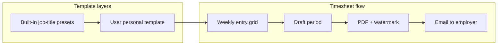

# Architecture

## Overview

Hourline is a personal timesheet app. Users pick a **job-title preset** or **personal template**, log **time entries** per week, mark a **timesheet period** ready, then preview a PDF and email it to their employer.

## Data model

| Entity | Purpose |
|--------|---------|
| `User` | Account, employer email settings, active template selection |
| `UserTimesheetTemplate` | Personal template forked from a preset with `fieldConfig` JSON |
| `TimesheetPeriod` | Week (or period) with `DRAFT` / `READY` / `SENT` status and frozen field snapshot |
| `TimeEntry` | Single log line: date, duration, mileage, metadata JSON |
| `Submission` | Audit log when a period PDF is emailed |

Built-in presets live in code (`lib/timesheet/presets.ts`): Field Engineer, Office/Desk, Consultant, Freelancer.

## Auth flow

- **Auth.js v5** with JWT sessions and credentials provider
- Passwords hashed with **bcrypt** (12 rounds)
- `middleware.ts` protects app routes; unauthenticated users redirect to `/login`

## Server actions

| Action | File | Purpose |
|--------|------|---------|
| `registerUser` | `actions/auth.ts` | Create account |
| `createTimeEntry` / `updateTimeEntry` / `deleteTimeEntry` | `actions/entries.ts` | CRUD entries |
| `preparePeriodAction` | `actions/periods.ts` | Mark period ready |
| `sendTimesheetToEmployer` | `actions/submissions.ts` | PDF + email |
| `createUserTemplate` / `updateUserTemplate` | `actions/templates.ts` | Personal templates |
| `updateUserSettings` | `actions/settings.ts` | Profile and submission prefs |

All mutations validate with **Zod** and scope data by `session.user.id`.

## PDF and email

1. User marks period `READY`
2. Preview via `GET /api/periods/[periodId]/pdf`
3. Send loads period + entries + settings → `@react-pdf/renderer` → Nodemailer attachment
4. `Submission` row created; period status → `SENT`

PDF footer watermark: `Generated with {APP_DISPLAY_NAME} · {date} · {user email}`

## UI

- **Next.js App Router** with server components for data pages
- **Transit design system** via `@zainalhassan/design-system` + shadcn/ui wrappers
- Domain components in `components/timesheet/`, `components/templates/`, `components/transit/`

## Security

- Row-level isolation via `userId` on periods, templates, and entries
- Periods in `SENT` status are read-only
- SMTP credentials server-side only
